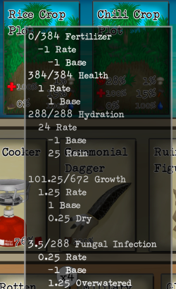

# Detailed Card Progress - Card Survival Tropical Island

This mod shows card status and progress related details in tooltip.

# Usage

## Install BepInEx

This mod works as a plug-in of BepInEx 5 framework.

See <https://docs.bepinex.dev/v5.4.21/articles/user_guide/installation/index.html>

## Mod Setup

- Download latest release from <https://github.com/computerfan/CstiDetailedCardProgress/releases>. 

- Extract `CstiDetailedCardProgress.dll` to `BepInEx/plugins folder`.

## Settings (Optional)

The configuration file can be found at /BepInEx/config/CstiDetailedCardProgress.cfg

|Name|Default|Description|
|--|--|--|
|Enabled|true|If set to true, will show the details tooltips|
|HotKey|F2|The key to enable and disable the tool tips|
|RecipesShowTargetDuration|false|If true, cookers like traps will show exact cooking duration instead of a range.|
|HideImpossibleDropSet|true|If true, impossible drop sets will be hidden.|
|TooltipNextPageHotKey|RightBracket|The key to show next page of the tool tip.|
|TooltipPreviousPageHotKey|LeftBracket|The key to show previous page of the tool tip.|

__Toggle Note__: When using the hotkey to enable/disable the detailed tooltips, the tooltips will not be updated until the user moves the mouse off of a card.

# Change Log

## 1.0.2
- Now it shows detailed weight of items and stats of character.

## 1.0.3 
- Adds enable/disable hotkey.
- Shows action staleness on character stats.
- Adds up rate modification from cooking recipe.

## 1.0.4
- Shows probabilities for results of actions in events.
- Adds tooltips to placed containers like chests (issue #2).

## 1.0.5
- Shows trap duration and drop probability.
- Adds up stacking passive effects of multiple cards.
- Add Simplified Chinese localization

## 1.0.6
- Shows liquid spoilage.
- No longer shows stat modifiers from unknown sources.

## 1.1.0
- Shows StatModifier and CardStateChange for DismantleCardActions (e.g. changes in satiation when eating food).
- Shows card drop, transform or destroy by DismantleCardActions.
- Minor bug fix.

## 1.1.1
- Long tootip texts can now be shown in multiple pages, use [ and ] keys to turn pages.
- Shows changes made by CardOnCardAction (e.g. results of fishing with a fishing rod).
- Shows possible results of scene exploration.
- New config entry HideImpossibleDropSet. Set to false to show all card drops even with a chance of %0.